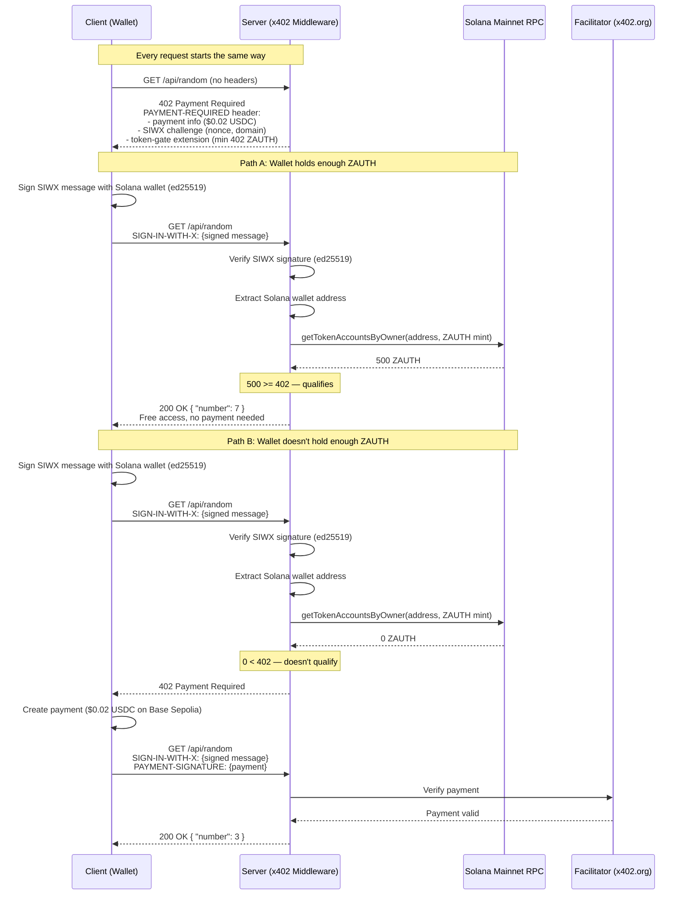

## What This Example Does

This is a paid API endpoint that returns a random number between 1 and 9. It costs $0.02 USDC per request on Base Sepolia. But there's a catch: if your Solana wallet holds at least 402 ZAUTH tokens on Solana mainnet, you get in for free. No API key, no account, no database lookup. You sign a message to prove which wallet you control, the server checks your on-chain SPL token balance in real time, and if you're holding enough ZAUTH, the door opens. If your balance is too low, you pay like everyone else.

## Why Build This?

The token gate pattern solves a fundamental question: **how do you give token holders free access to a paid service without building any user infrastructure?**

There's no user table, no OAuth, no API key management. The blockchain *is* the database. Your wallet balance *is* your membership card. The server just reads on-chain state at request time — if the balance is sufficient right now, you're in.

Here's where this pattern shows up in the real world:

- **Token holder perks** — You launch a utility token or NFT. Holders get free access to your paid APIs, analytics dashboards, or premium content. The gate is automatic — buy the token, get access. Sell it, lose access. No manual provisioning.

- **Community-gated services** — A DAO runs a paid oracle or data service. Members who hold the governance token use it for free. Non-members pay per request. The membership check is a single SPL token balance query — no membership database to maintain.

- **Freemium with on-chain identity** — You want a paid API with a free tier, but you don't want to build accounts and rate limiting. Instead, wallets holding a minimum balance get unlimited free access. Everyone else pays per call. The "free tier" is just a balance threshold.

## Architecture

Here's the full request flow, showing both paths through the system — the token holder path (free access) and the payment path:



> **Key difference from an allowlist:** the balance check hits an external system (the Solana RPC node) on every request. This makes the gate dynamic — if a wallet acquires tokens after being denied, the very next request will grant free access. No config changes, no restarts.

## Setup

### Prerequisites

- Node.js 18+
- A Solana wallet holding >= 402 ZAUTH tokens on Solana mainnet
- An EVM wallet with USDC on Base Sepolia (for payment tests)

### Step 1: Clone and install

```bash
git clone https://github.com/Must-be-Ash/siwx-token-gating.git
cd siwx-token-gating
npm install
```

### Step 2: Configure environment

Create a `.env.local` file:

```env
# Solana wallet — must hold >= 402 ZAUTH on Solana mainnet for free access
SVM_WALLET_ADDRESS=YourSolanaAddress
SVM_PRIVATE_KEY=YourBase58PrivateKey

# EVM payer wallet — needs ETH + USDC on Base Sepolia (for payment tests)
NON_ALLOWLISTED_WALLET_ADDRESS=0xPayerAddress
NON_ALLOWLISTED_WALLET_PRIVATE_KEY=0xPayerPrivateKey

# Token gate config
TOKEN_GATE_SOLANA_RPC=https://api.mainnet-beta.solana.com
TOKEN_GATE_MINT=DNhQZ1CE9qZ2FNrVhsCXwQJ2vZG8ufZkcYakTS5Jpump
TOKEN_GATE_MIN_BALANCE=402
```

What each variable does:

| Variable | Purpose |
|----------|---------|
| `SVM_WALLET_*` | The Solana wallet that will sign in via SIWX. Must hold >= 402 ZAUTH on Solana mainnet to trigger the free access path. |
| `NON_ALLOWLISTED_WALLET_*` | An EVM wallet used in tests to demonstrate the payment path. Needs USDC to pay $0.02 per request. |
| `TOKEN_GATE_SOLANA_RPC` | The Solana RPC endpoint used to query on-chain SPL token balances. Defaults to the public Solana mainnet RPC. |
| `TOKEN_GATE_MINT` | The SPL token mint address (ZAUTH: `DNhQZ1CE9qZ2FNrVhsCXwQJ2vZG8ufZkcYakTS5Jpump`). |
| `TOKEN_GATE_MIN_BALANCE` | The minimum ZAUTH token balance required for free access. Defaults to `402`. |

### Step 3: Fund the wallets

- **Solana wallet** — needs >= 402 ZAUTH tokens on Solana mainnet.
- **EVM payer wallet** — needs ETH (for gas) + USDC (for payment) on Base Sepolia. Get USDC from the [Circle faucet](https://faucet.circle.com/) (select Base Sepolia).

> **The Solana wallet does NOT need USDC.** It gets free access via the token gate — it never pays. Only the EVM payer wallet needs USDC for testing the payment path.

### Step 4: Verify your wallet balance

Before starting, confirm the Solana wallet has enough ZAUTH. You can check on a Solana explorer by looking up your wallet address and checking for the ZAUTH token (`DNhQZ1CE9qZ2FNrVhsCXwQJ2vZG8ufZkcYakTS5Jpump`).

### Step 5: Start the server

```bash
npm run dev
```

### Step 6: Test with curl

```bash
curl -i http://localhost:3000/api/random
```

Expected output:

```
HTTP/1.1 402 Payment Required
payment-required: eyJ4NDAyVmVyc2lvbi...
```

That `payment-required` header is a base64-encoded JSON object containing everything a client needs: payment details, the SIWX challenge, and the token-gate extension info. We'll decode it in a later section.

### Step 7: Run the test suite

```bash
npm test
```

This runs 5 tests covering every path through the system:

```
Test 1: 402 + token-gate extensions        → PASS
Test 2: Payment blocked without SIWX       → PASS
Test 3: Funded wallet free access           → PASS
Test 4: Empty wallet needs payment          → PASS
Test 5: Payer wallet SIWX + payment         → PASS
```

Or run the quick single test:

```bash
npm run test:quick
```

This signs in with your Solana wallet and reports whether free access was granted.

## The Middleware — Line by Line

The entire gate lives in `middleware.ts`. Let's walk through it.

### x402 resource server setup

This is the standard x402 boilerplate — same across every x402 app:

```typescript
const facilitatorClient = new HTTPFacilitatorClient({
  url: "https://x402.org/facilitator",
});

const resourceServer = new x402ResourceServer(facilitatorClient)
  .register("eip155:84532", new ExactEvmScheme())
  .registerExtension(siwxResourceServerExtension);
```

You're telling x402: "I accept payments on Base Sepolia (`eip155:84532`), using the exact payment scheme, and I support the SIWX extension."

### Route config and SIWX declaration

```typescript
const routes = {
  "/api/random": {
    accepts: [
      {
        scheme: "exact" as const,
        price: "$0.02",
        network: "eip155:84532" as const,
        payTo,
      },
    ],
    description: "Get a random number 1-9",
    mimeType: "application/json",
    extensions: {
      ...declareSIWxExtension({
        statement:
          "Sign in to verify token balance for free access to random number generator",
        expirationSeconds: 300,
        network: "solana:5eykt4UsFv8P8NJdTREpY1vzqKqZKvdp",
      }),
      "token-gate": {
        description:
          "Hold >= 402 ZAUTH (DNhQZ1CE9qZ2FNrVhsCXwQJ2vZG8ufZkcYakTS5Jpump) on Solana for free access",
        network: "solana:5eykt4UsFv8P8NJdTREpY1vzqKqZKvdp",
        token: "DNhQZ1CE9qZ2FNrVhsCXwQJ2vZG8ufZkcYakTS5Jpump",
        standard: "SPL",
        name: "zauthx402",
        ticker: "ZAUTH",
        minBalance: "402",
      },
    },
  },
};
```

This defines what the server advertises in the 402 response:

- **Price:** $0.02 USDC on Base Sepolia
- **SIWX extension:** Tells clients "you can sign in with your Solana wallet (ed25519)." The `statement` is the human-readable message the wallet will display when signing. The `expirationSeconds` means the signed message is valid for 5 minutes. The `network` specifies Solana mainnet (`solana:5eykt4UsFv8P8NJdTREpY1vzqKqZKvdp`).
- **Token-gate extension:** Custom metadata telling clients "there's a balance threshold — sign in and the server will check your on-chain ZAUTH balance." This includes the exact threshold (`minBalance: "402"`), the SPL token mint being checked, and the network (Solana mainnet). This is informational — it helps client apps display the right UI before the user even signs in.

### The balance checker — the on-chain data layer

```typescript
import { Connection, PublicKey } from "@solana/web3.js";
import {
  getAssociatedTokenAddressSync,
  getAccount,
  TokenAccountNotFoundError,
} from "@solana/spl-token";

const connection = new Connection(
  process.env.TOKEN_GATE_SOLANA_RPC || "https://api.mainnet-beta.solana.com"
);
const TOKEN_MINT = new PublicKey(process.env.TOKEN_GATE_MINT!);
const MIN_BALANCE = parseInt(process.env.TOKEN_GATE_MIN_BALANCE || "402", 10);

async function checkTokenBalance(
  address: string
): Promise<{ hasEnough: boolean; balance: number }> {
  try {
    const owner = new PublicKey(address);
    const ata = getAssociatedTokenAddressSync(TOKEN_MINT, owner);
    const account = await getAccount(connection, ata);
    const balance = Number(account.amount);

    return {
      hasEnough: balance >= MIN_BALANCE,
      balance,
    };
  } catch (err) {
    if (err instanceof TokenAccountNotFoundError) {
      return { hasEnough: false, balance: 0 };
    }
    throw err;
  }
}
```

This is the "database" — except it's a live blockchain query. Every time the gate runs, it derives the associated token account (ATA) for the wallet and ZAUTH mint, then queries its balance via `@solana/spl-token`'s `getAccount`. No caching, no stale data, no sync lag. The balance is whatever the chain says *right now*.

If the wallet has no ZAUTH token account at all (never held the token), `TokenAccountNotFoundError` is caught and returns `balance: 0`.

### The gate hook — where the magic happens

This is the core logic. It runs on every protected request, *before* x402 checks payment:

```typescript
function createTokenGateHook() {
  return async (context) => {
    const siwxHeader = context.adapter.getHeader("sign-in-with-x");
    const hasPayment = !!context.adapter.getHeader("payment-signature");
```

First, check what the client sent. There are four possible states:

**No SIWX, no payment — first request:**

```typescript
    if (!siwxHeader && !hasPayment) {
      return; // fall through → 402 with extensions
    }
```

The client hasn't done anything yet. Return `undefined` to let x402 send the 402 response with payment info and the SIWX challenge. This is the "here's what you need to do" response.

**Payment without SIWX — blocked:**

```typescript
    if (!siwxHeader && hasPayment) {
      return {
        abort: true as const,
        reason: "Sign in with your wallet first.",
      };
    }
```

The client is trying to pay without signing in. This gate requires SIWX on every request (even paid ones), so this is rejected with a 403. Why? Because the server needs to know *who* is paying — identity first, then payment.

**SIWX present — validate and check the balance:**

```typescript
    const payload = parseSIWxHeader(siwxHeader!);
    const resourceUri = context.adapter.getUrl();

    const validation = await validateSIWxMessage(payload, resourceUri);
    if (!validation.valid) {
      return { abort: true as const, reason: `Invalid signature: ${validation.error}` };
    }

    const verification = await verifySIWxSignature(payload);
    if (!verification.valid) {
      return { abort: true as const, reason: `Signature verification failed: ${verification.error}` };
    }

    const address = verification.address!;
```

Three steps: parse the SIWX header, validate the message (checks nonce, expiration, domain, URI), and verify the ed25519 signature. After this, you have the Solana wallet address — verified, not self-reported.

**The token balance check:**

```typescript
    const { hasEnough, balance } = await checkTokenBalance(address);

    if (hasEnough) {
      return { grantAccess: true as const };
    }

    return; // not enough → fall through to payment
```

This is the entire gate decision. The server queries the ZAUTH SPL token balance for the verified wallet address, compares against the threshold, and makes a binary choice:

- **Enough ZAUTH?** Return `{ grantAccess: true }` — this tells x402 to skip payment entirely and serve the endpoint directly.
- **Not enough?** Return `undefined` — fall through to standard x402 payment verification.

> **The `grantAccess: true` return is the free access bypass.** It short-circuits the entire payment flow. The request goes straight to your route handler (`app/api/random/route.ts`) as if there was no paywall at all. The wallet never needs USDC, the facilitator is never contacted, no on-chain payment happens.

## Understanding SIWX

### What is SIWX?

SIWX (Sign-In with X) is a wallet authentication standard based on [CAIP-122](https://chainagnostic.org/CAIPs/caip-122). It lets a server verify that a client controls a specific wallet address — without requiring accounts, passwords, or API keys. It supports both EVM wallets (eip191) and Solana wallets (ed25519).

Think of it like showing your membership card at a club. You're not paying to get in (that's what `PAYMENT-SIGNATURE` is for). You're proving who you are. The bouncer (the server) checks your card (the SIWX signature), then looks up whether your membership tier qualifies for free entry (the balance check). If your balance is high enough, you walk in free. If not, you pay cover.

### Two headers, two purposes

x402 with SIWX uses two separate headers, and they do completely different things:

| Header | Purpose | Analogy |
|--------|---------|---------|
| `SIGN-IN-WITH-X` | Proves wallet identity | Showing your membership card |
| `PAYMENT-SIGNATURE` | Authorizes a payment | Handing over cash |

These can even come from different wallets *on different chains*. In this example, you sign in with a Solana wallet (to prove you hold ZAUTH tokens) and if the balance is insufficient, payment falls back to an EVM wallet (that holds USDC on Base Sepolia). The SIWX identity and payment are fully decoupled.

### The challenge-response flow

SIWX works as a three-step dance:

**1. Server issues a challenge (in the 402 response):**

The server generates a unique nonce, sets an expiration, and includes a human-readable statement. This goes into the `sign-in-with-x` extension of the 402 response.

**2. Client signs the challenge:**

The wallet signs a structured message containing the nonce, domain, URI, and statement using ed25519 (for Solana). This proves the client controls the private key for that wallet address. The signed message goes into the `SIGN-IN-WITH-X` header.

**3. Server verifies the signature:**

The server recovers the wallet address from the ed25519 signature, checks the nonce hasn't been reused, verifies the domain and URI match, and confirms the message hasn't expired. Now the server knows — cryptographically — which Solana wallet is making the request. It can then query that wallet's on-chain ZAUTH balance.

### The SIWX payload structure

Here's what's inside the `SIGN-IN-WITH-X` header after the client signs (decoded from base64):

```json
{
  "domain": "localhost",
  "address": "Fa2V4RxCAxqemT7WdrTR7EPqyJw6PgPHc5LUyTbcG4NE",
  "statement": "Sign in to verify token balance for free access to random number generator",
  "uri": "http://localhost:3000/api/random",
  "version": "1",
  "chainId": "solana:5eykt4UsFv8P8NJdTREpY1vzqKqZKvdp",
  "type": "ed25519",
  "nonce": "41535e216c52012cc8e4369ce52931da",
  "issuedAt": "2026-03-12T20:17:05.465Z",
  "expirationTime": "2026-03-12T20:22:05.466Z",
  "resources": ["http://localhost:3000/api/random"],
  "signature": "Base58EncodedSignature..."
}
```

- **domain** — the server's domain (prevents replay attacks on other servers)
- **address** — the Solana wallet claiming to sign (Base58 encoded, the server verifies this matches the signature)
- **statement** — what the user agreed to when signing
- **nonce** — one-time value from the server's challenge (prevents replay)
- **expirationTime** — 5 minutes from `issuedAt` (set by `expirationSeconds: 300`)
- **chainId** — Solana mainnet (`solana:5eykt4UsFv8P8NJdTREpY1vzqKqZKvdp`)
- **type** — ed25519 (Solana's signature scheme)
- **signature** — the Base58-encoded ed25519 proof that this wallet signed this exact message

## Anatomy of the 402 Response

When you `curl http://localhost:3000/api/random`, the server returns a 402 with a `payment-required` header. Here's that header decoded:

```json
{
  "x402Version": 2,
  "error": "Payment required",
  "resource": {
    "url": "http://localhost:3000/api/random",
    "description": "Get a random number 1-9",
    "mimeType": "application/json"
  },
  "accepts": [
    {
      "scheme": "exact",
      "network": "eip155:84532",
      "amount": "20000",
      "asset": "0x036CbD53842c5426634e7929541eC2318f3dCF7e",
      "payTo": "0xF7C645b7600Fb6AaE07Fd0Cf31112A7788BE8F85",
      "maxTimeoutSeconds": 300,
      "extra": {
        "name": "USDC",
        "version": "2"
      }
    }
  ],
  "extensions": {
    "sign-in-with-x": {
      "info": {
        "domain": "localhost",
        "uri": "http://localhost:3000/api/random",
        "version": "1",
        "nonce": "41535e216c52012cc8e4369ce52931da",
        "issuedAt": "2026-03-12T20:17:05.465Z",
        "resources": [
          "http://localhost:3000/api/random"
        ],
        "expirationTime": "2026-03-12T20:22:05.466Z",
        "statement": "Sign in to verify token balance for free access to random number generator"
      },
      "supportedChains": [
        {
          "chainId": "solana:5eykt4UsFv8P8NJdTREpY1vzqKqZKvdp",
          "type": "ed25519"
        }
      ]
    },
    "token-gate": {
      "description": "Hold >= 402 ZAUTH (DNhQZ1CE9qZ2FNrVhsCXwQJ2vZG8ufZkcYakTS5Jpump) on Solana for free access",
      "network": "solana:5eykt4UsFv8P8NJdTREpY1vzqKqZKvdp",
      "token": "DNhQZ1CE9qZ2FNrVhsCXwQJ2vZG8ufZkcYakTS5Jpump",
      "standard": "SPL",
      "name": "zauthx402",
      "ticker": "ZAUTH",
      "minBalance": "402"
    }
  }
}
```

Let's break this down:

### Payment options (`accepts`)

- **scheme: "exact"** — pay the exact amount, no tipping or variable pricing
- **network: "eip155:84532"** — Base Sepolia testnet
- **amount: "20000"** — $0.02 in USDC's smallest unit (USDC has 6 decimals, so 20000 = 0.02)
- **asset** — the USDC contract address on Base Sepolia
- **payTo** — the wallet that receives payment

### SIWX challenge (`extensions.sign-in-with-x`)

- **info** — the challenge data the client must sign. The `nonce` is unique per request (prevents replay), and the `expirationTime` gives the client 5 minutes to respond.
- **supportedChains** — which chains and signing methods the server accepts. `ed25519` is Solana's native signing scheme, and `solana:5eykt4UsFv8P8NJdTREpY1vzqKqZKvdp` is Solana mainnet.
- **statement** — the human-readable text shown to the user when signing: *"Sign in to verify token balance for free access to random number generator"*

### Token-gate extension (`extensions.token-gate`)

- **description** — human-readable explanation of the gate
- **network** — the chain where the balance is checked (Solana mainnet)
- **token** — the SPL token mint address being checked (ZAUTH)
- **standard** — the token standard (`SPL`)
- **name** / **ticker** — the token's name (`zauthx402`) and ticker (`ZAUTH`)
- **minBalance** — the threshold for free access (402 ZAUTH tokens)

This extension is custom metadata — it doesn't affect the x402 protocol itself. But it tells client apps exactly what's needed for free access. A smart client could read this, check its own ZAUTH balance locally, and decide whether to sign in (if it has enough ZAUTH) or skip straight to payment (if it doesn't).

> **The 402 response is the server saying: "Here's the price. But if you hold enough ZAUTH, sign in and prove it — you'll get in free."** The client gets all the information upfront to decide which path to take.
