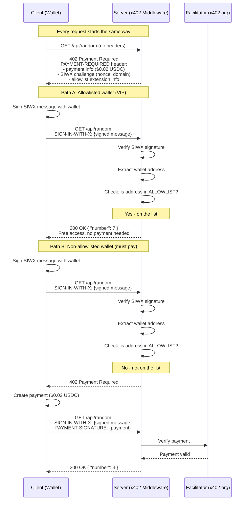

## What This Example Does

This is a paid API endpoint that returns a random number between 1 and 9. It costs $0.02 USDC per request on Base Sepolia. But there's a twist: if your wallet address is on a VIP allowlist, you get in for free. You don't need to pay, you don't need an API key, you don't need an account. You just sign a message with your wallet to prove who you are, and the server checks if you're on the list. If you are, the door opens. If you're not, you pay like everyone else.

## Why Build This?

The allowlist pattern solves a common problem: **how do you give certain wallets free access to a paid service without building an account system?**

There's no database of users, no API key management, no OAuth flow. The wallet *is* the identity. The allowlist *is* the access control. Everything else is handled by x402 and SIWX.

Here's where this pattern shows up in the real world:

- **Beta testing** — You're launching a paid API. Before going public, you add your testers' wallet addresses to the allowlist. They use the API for free while you iterate. When beta ends, remove their addresses and everyone pays.

- **Partner access** — You have a business deal where another company's agents or services get free access. Add their wallet addresses to the config. No invoicing, no API key rotation, no shared secrets. Their wallet identity is their access pass.

- **Internal tooling** — Your own team needs to hit production endpoints for debugging and monitoring. Instead of maintaining a separate set of internal API keys, add your team's wallets to the allowlist. They sign in with SIWX and bypass the paywall.

## Architecture

Here's the full request flow, showing both paths through the system — the VIP path (free access) and the payment path:



## Setup

### Prerequisites

- Node.js 18+
- Three EVM wallets (you'll generate these below)
- Base Sepolia testnet ETH + USDC for one of the wallets

### Step 1: Clone and install

```bash
git clone <repo-url> allowlist
cd allowlist
npm install
```

### Step 2: Generate wallets

You need three wallets, each playing a different role in the tests. You can generate them with a quick script:

```bash
node -e "
const { generatePrivateKey, privateKeyToAccount } = require('viem/accounts');
for (const name of ['ALLOWLISTED', 'NON_ALLOWLISTED', 'UNFUNDED']) {
  const key = generatePrivateKey();
  const acc = privateKeyToAccount(key);
  console.log(name + '_WALLET_ADDRESS=' + acc.address);
  console.log(name + '_WALLET_PRIVATE_KEY=' + key);
  console.log('');
}
"
```

### Step 3: Configure environment

```bash
cp .env.example .env.local
```

Open `.env.local` and fill in the wallet values from step 2. Then set `ALLOWLIST_ADDRESSES` to the allowlisted wallet's address:

```env
# This wallet is on the VIP list (free access, no funds needed)
ALLOWLISTED_WALLET_ADDRESS=0xYourAllowlistedAddress
ALLOWLISTED_WALLET_PRIVATE_KEY=0xYourAllowlistedKey

# This wallet must pay (needs testnet funds)
NON_ALLOWLISTED_WALLET_ADDRESS=0xYourFundedAddress
NON_ALLOWLISTED_WALLET_PRIVATE_KEY=0xYourFundedKey

# This wallet can't pay (no funds, not on the list)
UNFUNDED_WALLET_ADDRESS=0xYourUnfundedAddress
UNFUNDED_WALLET_PRIVATE_KEY=0xYourUnfundedKey

# The VIP list — add the allowlisted wallet here
ALLOWLIST_ADDRESSES=0xYourAllowlistedAddress
```

> **Important:** Only the `NON_ALLOWLISTED` wallet needs testnet funds. The allowlisted wallet gets free access (no funds needed), and the unfunded wallet is specifically meant to demonstrate what happens when you can't pay.

### Step 4: Fund the non-allowlisted wallet

Get Base Sepolia testnet tokens:

- **ETH** — use a Base Sepolia faucet
- **USDC** — use the [Circle USDC faucet](https://faucet.circle.com/) (select Base Sepolia)

You only need a small amount. Each request costs $0.02 USDC.

### Step 5: Start the server

```bash
npm run dev
```

### Step 6: Test with curl

```bash
curl -i http://localhost:3000/api/random
```

Expected output:

```
HTTP/1.1 402 Payment Required
payment-required: eyJ4NDAyVmVyc2lvbi...
```

That `payment-required` header is a base64-encoded JSON object containing everything a client needs: payment details, the SIWX challenge, and the allowlist extension info. We'll decode it in a later section.

### Step 7: Run the test suite

```bash
npm test
```

This runs 6 tests that cover every path through the system:

```
Test 1: 402 + allowlist extensions          → PASS
Test 2: Payment blocked without SIWX       → PASS
Test 3: VIP wallet free access             → PASS
Test 4: Non-VIP wallet needs payment       → PASS
Test 5: Non-VIP wallet can pay             → PASS
Test 6: Unfunded wallet can't pay          → PASS
```

## The Middleware — Line by Line

The entire gate lives in `middleware.ts`. Let's walk through it.

### x402 resource server setup

This is the standard x402 boilerplate — same across every x402 app:

```typescript
const facilitatorClient = new HTTPFacilitatorClient({
  url: "https://x402.org/facilitator",
});

const resourceServer = new x402ResourceServer(facilitatorClient)
  .register("eip155:84532", new ExactEvmScheme())
  .registerExtension(siwxResourceServerExtension);
```

You're telling x402: "I accept payments on Base Sepolia (`eip155:84532`), using the exact payment scheme, and I support the SIWX extension."

### Route config and SIWX declaration

```typescript
const routes = {
  "/api/random": {
    accepts: [
      {
        scheme: "exact" as const,
        price: "$0.02",
        network: "eip155:84532" as const,
        payTo,
      },
    ],
    description: "Get a random number 1-9",
    mimeType: "application/json",
    extensions: {
      ...declareSIWxExtension({
        statement: "Sign in to check VIP access for random number generator",
        expirationSeconds: 300,
      }),
      allowlist: {
        description: "VIP wallets get free access — sign in with SIWX to check",
      },
    },
  },
};
```

This defines what the server advertises in the 402 response:

- **Price:** $0.02 USDC on Base Sepolia
- **SIWX extension:** Tells clients "you can sign in with your wallet." The `statement` is the human-readable message the wallet will display when signing. The `expirationSeconds` means the signed message is valid for 5 minutes.
- **Allowlist extension:** Custom metadata telling clients "there's a VIP list — sign in to check if you're on it." This is purely informational — it helps clients understand *why* SIWX is being requested.

### The allowlist — the entire data layer

```typescript
const ALLOWLIST: Set<string> = new Set(
  (process.env.ALLOWLIST_ADDRESSES || "")
    .split(",")
    .map((addr) => addr.trim().toLowerCase())
    .filter(Boolean)
);

function isAllowlisted(address: string): boolean {
  return ALLOWLIST.has(address.toLowerCase());
}
```

That's it. The "database" is a comma-separated env var parsed into a `Set` at startup. The lookup is a case-insensitive `Set.has()` call. No database driver, no connection pool, no ORM. This is what makes this example the simplest SIWX gate — the check itself is trivial, so you can focus on learning the SIWX pattern without any distractions.

### The gate hook — where the magic happens

This is the core logic. It runs on every protected request, *before* x402 checks payment:

```typescript
function createAllowlistGateHook() {
  return async (context) => {
    const siwxHeader = context.adapter.getHeader("sign-in-with-x");
    const hasPayment = !!context.adapter.getHeader("payment-signature");
```

First, check what the client sent. There are four possible states:

**No SIWX, no payment — first request:**

```typescript
    if (!siwxHeader && !hasPayment) {
      return; // fall through → 402 with extensions
    }
```

The client hasn't done anything yet. Return `undefined` to let x402 send the 402 response with payment info and the SIWX challenge. This is the "here's what you need to do" response.

**Payment without SIWX — blocked:**

```typescript
    if (!siwxHeader && hasPayment) {
      return {
        abort: true as const,
        reason: "Sign in with your wallet first.",
      };
    }
```

The client is trying to pay without signing in. This gate requires SIWX on every request (even paid ones), so this is rejected with a 403.

**SIWX present — validate and check the list:**

```typescript
    const payload = parseSIWxHeader(siwxHeader!);
    const resourceUri = context.adapter.getUrl();

    const validation = await validateSIWxMessage(payload, resourceUri);
    if (!validation.valid) {
      return { abort: true as const, reason: `Invalid signature: ${validation.error}` };
    }

    const verification = await verifySIWxSignature(payload);
    if (!verification.valid) {
      return { abort: true as const, reason: `Signature verification failed: ${verification.error}` };
    }

    const address = verification.address!;
```

Three steps: parse the SIWX header, validate the message (checks nonce, expiration, domain, URI), and verify the cryptographic signature. After this, you have the wallet address — verified, not self-reported.

**The allowlist check:**

```typescript
    if (isAllowlisted(address)) {
      return { grantAccess: true as const };
    }

    return; // not on the list → fall through to payment
```

This is the entire gate decision. If the wallet is on the list, return `{ grantAccess: true }` — this tells x402 to skip payment and serve the endpoint directly. If not, return `undefined` to fall through to standard x402 payment verification.

> **The `grantAccess: true` return is the free access bypass.** It short-circuits the entire payment flow. The request goes straight to your route handler (`app/api/random/route.ts`) as if there was no paywall at all.

## Understanding SIWX

### What is SIWX?

SIWX (Sign-In with X) is a wallet authentication standard based on [CAIP-122](https://chainagnostic.org/CAIPs/caip-122). It lets a server verify that a client controls a specific wallet address — without requiring accounts, passwords, or API keys.

Think of it like showing your ID at the door. You're not paying to get in (that's what `PAYMENT-SIGNATURE` is for). You're proving who you are. The bouncer (the server) checks your ID (the SIWX signature) against the guest list (the allowlist). If you're on it, you walk in free. If not, you pay cover.

### Two headers, two purposes

x402 with SIWX uses two separate headers, and they do completely different things:

| Header | Purpose | Analogy |
|--------|---------|---------|
| `SIGN-IN-WITH-X` | Proves wallet identity | Showing your ID |
| `PAYMENT-SIGNATURE` | Authorizes a payment | Handing over cash |

These can even come from different wallets. You might sign in with a cold wallet (to prove identity) and pay from a hot wallet (that holds your USDC). In this example, both come from the same wallet, but the separation matters architecturally.

### The challenge-response flow

SIWX works as a three-step dance:

**1. Server issues a challenge (in the 402 response):**

The server generates a unique nonce, sets an expiration, and includes a human-readable statement. This goes into the `sign-in-with-x` extension of the 402 response.

**2. Client signs the challenge:**

The wallet signs a structured message containing the nonce, domain, URI, and statement. This proves the client controls the private key for that wallet address. The signed message goes into the `SIGN-IN-WITH-X` header.

**3. Server verifies the signature:**

The server recovers the wallet address from the signature, checks the nonce hasn't been reused, verifies the domain and URI match, and confirms the message hasn't expired. Now the server knows — cryptographically — which wallet is making the request.

### The SIWX payload structure

Here's what's inside the `SIGN-IN-WITH-X` header after the client signs (decoded from base64):

```json
{
  "domain": "localhost",
  "address": "0xAbF01df9428EaD5418473A7c91244826A3Af23b3",
  "statement": "Sign in to check VIP access for random number generator",
  "uri": "http://localhost:3000/api/random",
  "version": "1",
  "chainId": "eip155:84532",
  "type": "eip191",
  "nonce": "7507cb22206f60c0b453b971a9a357b6",
  "issuedAt": "2026-03-12T18:23:47.752Z",
  "expirationTime": "2026-03-12T18:28:47.752Z",
  "resources": ["http://localhost:3000/api/random"],
  "signature": "0x..."
}
```

- **domain** — the server's domain (prevents replay attacks on other servers)
- **address** — the wallet claiming to sign
- **statement** — what the user agreed to when signing
- **nonce** — one-time value from the server's challenge (prevents replay)
- **expirationTime** — 5 minutes from `issuedAt` (set by `expirationSeconds: 300`)
- **signature** — the cryptographic proof that this wallet signed this exact message

## Anatomy of the 402 Response

When you `curl http://localhost:3000/api/random`, the server returns a 402 with a `payment-required` header. Here's that header decoded:

```json
{
  "x402Version": 2,
  "error": "Payment required",
  "resource": {
    "url": "http://localhost:3000/api/random",
    "description": "Get a random number 1-9",
    "mimeType": "application/json"
  },
  "accepts": [
    {
      "scheme": "exact",
      "network": "eip155:84532",
      "amount": "20000",
      "asset": "0x036CbD53842c5426634e7929541eC2318f3dCF7e",
      "payTo": "0xC55bBDD975256f88cD34Fe77F95A24660e5543AE",
      "maxTimeoutSeconds": 300,
      "extra": {
        "name": "USDC",
        "version": "2"
      }
    }
  ],
  "extensions": {
    "sign-in-with-x": {
      "info": {
        "domain": "localhost",
        "uri": "http://localhost:3000/api/random",
        "version": "1",
        "nonce": "7507cb22206f60c0b453b971a9a357b6",
        "issuedAt": "2026-03-12T18:23:47.752Z",
        "expirationTime": "2026-03-12T18:28:47.752Z",
        "statement": "Sign in to check VIP access for random number generator",
        "resources": ["http://localhost:3000/api/random"]
      },
      "supportedChains": [
        {
          "chainId": "eip155:84532",
          "type": "eip191"
        }
      ]
    },
    "allowlist": {
      "description": "VIP wallets get free access — sign in with SIWX to check"
    }
  }
}
```

Let's break this down:

### Payment options (`accepts`)

- **scheme: "exact"** — pay the exact amount, no tipping or variable pricing
- **network: "eip155:84532"** — Base Sepolia testnet
- **amount: "20000"** — $0.02 in USDC's smallest unit (USDC has 6 decimals, so 20000 = 0.02)
- **asset** — the USDC contract address on Base Sepolia
- **payTo** — the wallet that receives payment

### SIWX challenge (`extensions.sign-in-with-x`)

- **info** — the challenge data the client must sign. The `nonce` is unique per request (prevents replay), and the `expirationTime` gives the client 5 minutes to respond.
- **supportedChains** — which chains and signing methods the server accepts. `eip191` is standard Ethereum personal_sign.

### Allowlist extension (`extensions.allowlist`)

- **description** — human-readable text telling the client why SIWX is being requested. This is custom metadata — it doesn't affect protocol behavior, but it tells client apps (or users reading the raw response) that there's a VIP path available.

> **The 402 response is the server saying: "Here's the price. But if you're a VIP, sign in and prove it — you might get in free."** The client gets to choose: sign in to check the list, or just pay and skip the identity step.
